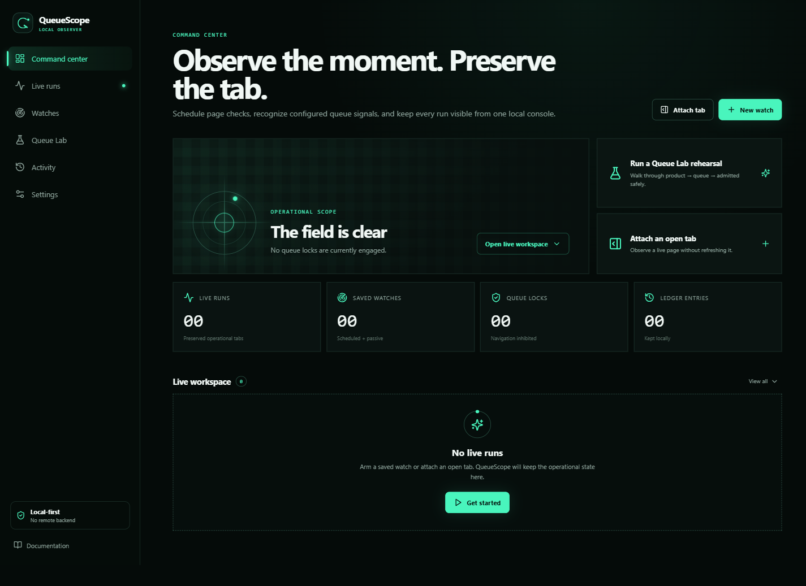
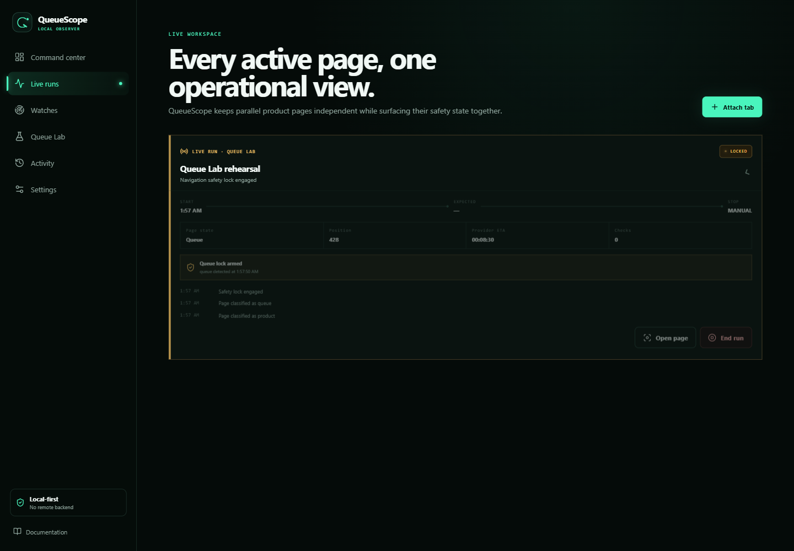
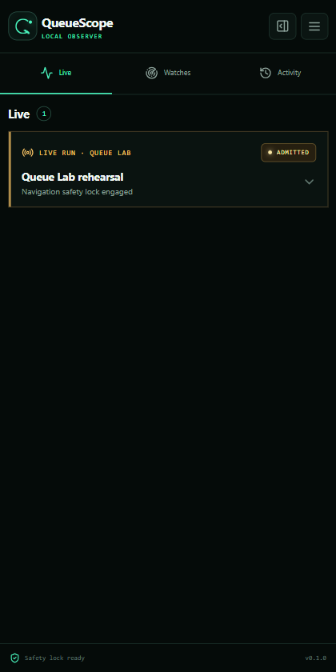
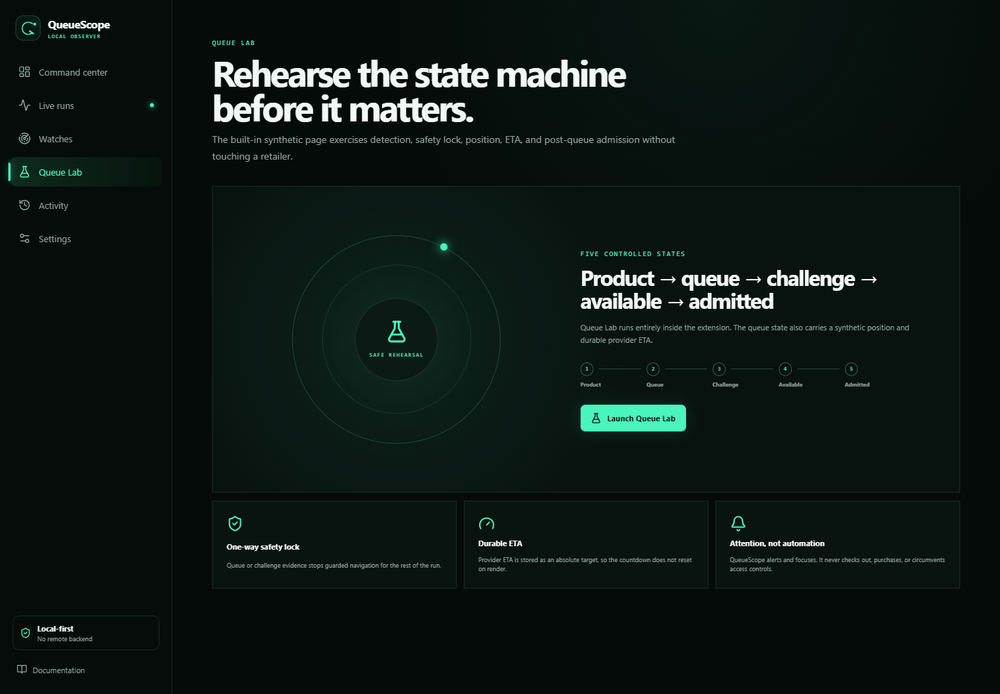

<p align="center">
  
</p>

# QueueScope

**A local-first browser control plane for time-sensitive web events.**

QueueScope turns visible page signals into durable, human-readable runs. Schedule a page watch or attach an already-open tab, keep parallel pages independent, stop guarded refresh when a queue or challenge appears, and bring the right tab forward when attention matters.

This is the retailer-neutral public edition. It contains no site-specific adapters, selectors, URLs, captured production pages, provider endpoints, checkout automation, or private operational history.



## What works in v0.1.0

- One-time, daily, weekday, weekend, and custom-weekday schedules.
- Passive watches with user-controlled cadence and no attempt ceiling.
- Baseline and fast cadences around an optional expected-event time.
- Guarded refresh or observe-only operation per watch.
- Multiple independent runs and preserved tabs, including pages on the same origin.
- Attach to an open HTTP(S) tab without refreshing it.
- Plain-text queue, admitted, challenge, and unavailable rules.
- CSS availability selectors plus position and ETA extraction patterns.
- A one-way navigation safety lock after configured queue or challenge evidence.
- Admission detection only after prior queue evidence.
- Durable provider ETA stored as an absolute timestamp.
- Local notifications, generated sounds, configurable low-ETA warning, and optional focus-on-admission.
- Collapsed-by-default run cards in the command center and compact side panel.
- Local run history, copy/edit/delete/arm watch controls, old-watch shelf, reduced motion, and compact density.
- A built-in synthetic Queue Lab and real unpacked-extension E2E test.

QueueScope observes, coordinates, and alerts. It does not click purchase controls, add products to carts, check out, solve challenges, create extra queue identities, rotate proxies, spoof fingerprints, or call undocumented provider APIs.

## Live workspace

These images are captured from the packaged Manifest V3 extension during its browser test—not static mockups.

### Queue-locked run



### Compact side panel



### Queue Lab

Queue Lab proves product, queue, challenge, availability, position/ETA, and post-queue admission transitions without contacting an external website.



## Install locally

### From the release archive

1. Download `QueueScope-0.1.0-unpacked.zip` from the release assets.
2. Extract it to a permanent local folder.
3. Open your Chromium browser's extensions page (for Chrome, `chrome://extensions`).
4. Enable **Developer mode**.
5. Select **Load unpacked** and choose the extracted folder.
6. Pin QueueScope. Its toolbar action opens the side panel; the extension details page links to the full command center.
7. Open **Queue Lab** first to validate the installation safely.

For Comet or another Chromium browser, use that browser's equivalent extensions page and the same unpacked folder.

### Build from source

Requirements: Node.js 20 or newer and PowerShell on Windows for the packaging command.

```powershell
npm ci
npm run check
npm run build
```

Load the generated `dist` folder as the unpacked extension. To run the real browser workflow and create screenshots:

```powershell
npm run test:e2e
npm run package
```

## First watch

1. Select **New watch**.
2. Enter an HTTP(S) page URL and choose **Scheduled drop** or **Passive scout**.
3. Choose **Guarded refresh** only when periodic reloads are appropriate; use **Observe only** for a live queue or sensitive tab.
4. Set start, expected, and stop times. Start/stop authorize checking; expected time only controls the fast-cadence window.
5. Describe the visible page phrases/selectors that mean queue, challenge, availability, or admitted.
6. Save, then arm. QueueScope requests optional access to that origin at this point.

Page markup changes. Treat a rule as an explicit hypothesis, rehearse it when possible, and keep consequential actions manual.

## Safety model

```text
scheduled or passive watch
  -> preserved tab
  -> bounded visible-page observation
  -> normalized local evidence
  -> per-run state machine
       -> queue/challenge: permanent navigation lock
       -> availability: attention, no clicking
       -> admitted: valid only after a queue lock
  -> local notification + human handoff
```

- Arbitrary-site access is optional and requested per origin.
- There is no cookie or browsing-history permission.
- No analytics, account, cloud backend, or remote code is used.
- Evidence text, selectors, patterns, URLs, and runtime messages are validated and bounded.
- Queue-sensitive tabs are marked non-discardable until the run ends.
- Extension restart rehydrates alarms, observers, and tab protection without navigating a locked run.

See [Privacy and safety](docs/PRIVACY_AND_SAFETY.md), [Architecture](docs/ARCHITECTURE.md), and [Rule builder guide](docs/RULE_BUILDER.md).

## Validation

The v0.1.0 release gate covers:

- ESLint and TypeScript.
- 26 deterministic unit tests.
- Production MV3 build and artifact inspection.
- Disposable-profile Chromium E2E.
- Queue lock, position `428`, durable ETA, post-queue admission, and non-discardable-tab assertions.
- Command-center and 420×840 side-panel screenshots.
- Dependency audit, CSP/permission audit, secret scan, source/history neutrality scan, and manual visual review.

The detailed evidence is in [Test report](docs/TEST_REPORT.md), [Security review](docs/SECURITY_REVIEW.md), and [Release checklist](docs/RELEASE_CHECKLIST.md).

## Project status

v0.1.0 is a functional developer-mode alpha. The private repository is ready for its owner to review and manually change to public. The current scope intentionally favors transparent, user-authored visible-page rules over bundled site integrations.

- [Plan and completed scope](PLAN.md)
- [Changelog](CHANGELOG.md)
- [Contributing](CONTRIBUTING.md)
- [Security policy](SECURITY.md)

Licensed under the [MIT License](LICENSE).
