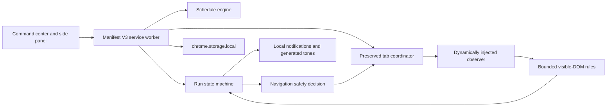

# QueueScope architecture

## Runtime map

The extension has no backend. The service worker serializes snapshot mutations, rehydrates alarms and tab protection after restart, and injects the observer only into a tab owned by an active run.

## Major modules

- `src/core/schedule.ts`: timezone-aware one-time and recurring windows.
- `src/core/rules.ts`: bounded text, selector, position, and ETA classification.
- `src/core/state-machine.ts`: cadence, state transitions, queue-lock monotonicity, and refresh decisions.
- `src/core/validation.ts`: URL canonicalization, rule validation, settings bounds, and runtime-message allowlist.
- `src/background/service-worker.ts`: alarms, optional permissions, tabs, notifications, storage, and restart recovery.
- `src/content/observer-standalone.js`: self-contained visible-page observer injected into authorized run tabs.
- `src/ui`: React command center, watch builder, and side-panel surface.
- `harness`: synthetic Queue Lab used by people and E2E.

## Core invariants

1. Configured queue or challenge evidence engages a one-way lock before another guarded refresh can be scheduled.
2. Admission is accepted only after the run already holds a queue/challenge lock.
3. Attached tabs are always observe-only.
4. Position is provider-exposed evidence, not a claim about people ahead.
5. Provider ETA is persisted as an absolute timestamp.
6. Unknown position, ETA, and page state stay explicitly unknown.
7. Consequential actions remain human-controlled.

## Observation boundary

The page observer reads at most 100,000 characters of visible text, checks one validated CSS selector, and evaluates bounded user patterns. It emits a normalized observation with a bounded title, URL, evidence list, classification, confidence, optional position, and optional ETA.

It does not receive or read cookies, authorization headers, credentials, browser history, network responses, local storage belonging to the page, or private APIs. It cannot click or submit page controls.

## Scheduling and navigation

A scheduled run has explicit `startAt`, optional `expectedAt`, and `stopAt` values. Start/stop authorize activity. Expected time only selects the fast cadence inside the configured before/after window. A passive run starts immediately and ends only when the user stops it.

The service worker creates a dedicated background tab for an armed saved watch. A user can instead attach an existing tab, which forces observe-only mode. Before a guarded reload, the worker consults the current run state; a queue lock, attention state, stop boundary, or future next-check time defeats navigation.

## Storage and recovery

One versioned snapshot in `chrome.storage.local` contains saved watches, active runs, bounded history, and settings. Each mutation is serialized. On worker startup QueueScope:

1. reloads the snapshot;
2. reapplies `autoDiscardable: false` to locked tabs;
3. reinjects observers into active HTTP(S) run tabs;
4. reconstructs run and recurrence alarms;
5. starts only schedules whose active window is open.

Recovery does not navigate a locked tab.

## Permissions

Core permissions are alarms, notifications, offscreen audio, side panel, local storage, scripting, and tab coordination. Arbitrary HTTP(S) host access is optional. The UI requests only the selected page origin when the user arms or attaches it. Localhost is included for Queue Lab development. There is no cookie or browsing-history permission.

## Build and test boundary

Vite builds extension pages and the module service worker. The content observer is intentionally self-contained and copied as an audited IIFE. The build verifier checks required assets, MV3, optional host access, absence of globally declared content scripts, remote executable/data requests, and dynamic code execution.

The real E2E launches the built `dist` folder in a disposable Chromium profile and drives Queue Lab through queue lock and admission.
