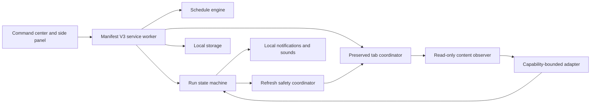

# QueueScope architecture

## System boundary

QueueScope converts page observations into a durable local run state. The scheduler decides when a run may check; the safety coordinator decides whether a refresh is allowed; adapters only describe what the current page visibly exposes.

## Core invariants

1. Queue, challenge, rate-limit, admission, and purchase-window evidence disables guarded refresh before another reload is authorized.
2. A resource-specific queue locks only its run unless the evidence is origin-wide.
3. Site-wide challenges and rate limits lock every active run on that origin.
4. Provider timing is stored as an absolute timestamp whenever possible.
5. Weak observations cannot replace stronger evidence without an explicit transition rule.
6. Unknown position, timing, and availability values remain unknown.
7. Consequential actions remain human-controlled.

## Adapter boundary

Public adapters are declarative observation components. They receive a read-only, bounded representation of the page and return normalized evidence. They do not receive cookies, browser credentials, arbitrary network access, or purchase capabilities.

The initial public adapter SDK should support visible DOM evidence and user-authored selectors. Any future capability must be documented, permission-scoped, and covered by conformance tests.

## Storage

The first public release stores data only in extension-local storage:

- User settings.
- Saved watch definitions.
- Active run snapshots.
- Bounded event history.
- Optional local outcome history.

Export is explicit. No cloud synchronization or analytics service is planned for the initial release.

## Runtime recovery

Manifest V3 service workers are ephemeral. QueueScope must rebuild alarms, observers, and tab protection from the stored snapshot whenever the worker restarts. Recovery must not navigate or refresh an already queue-sensitive tab.

## Test architecture

The demo lab is the reference provider. It exposes deterministic visible state markers and verifies that the production extension can move through the full state machine without external traffic. Release validation uses a disposable browser profile and manually reviewed screenshots.

